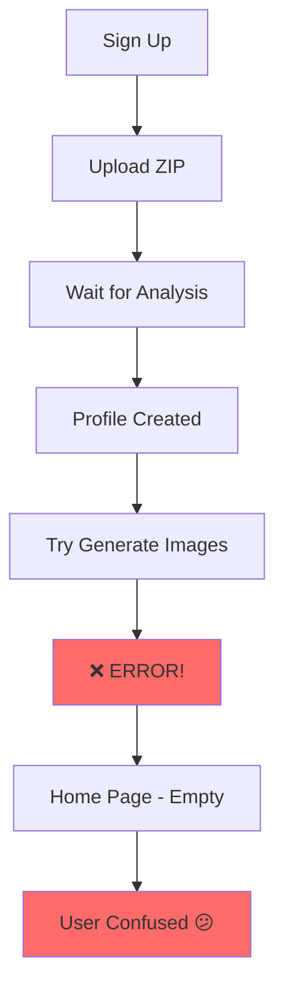
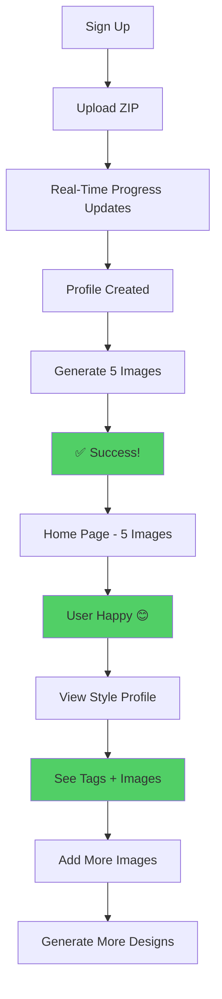

# 🎨 Visual Guide: Onboarding Fixes

## Before vs After

### 1. Onboarding Flow

#### BEFORE ❌
```
User uploads ZIP
    ↓
Images analyzed
    ↓
Style profile created
    ↓
❌ Try to generate images → ERROR!
   (promptBuilderAgent throws error: "No style profile found")
    ↓
User lands on Home page
    ↓
🚫 No images to show
```

#### AFTER ✅
```
User uploads ZIP
    ↓
Images analyzed (with real-time progress!)
    ↓
Style profile created
    ↓
✅ Generate 5 images using DEFAULT PROMPTS
   (promptBuilderAgent uses generic fashion vocabulary)
    ↓
User lands on Home page
    ↓
🎉 5 beautiful AI-generated images ready!
```

---

### 2. Style Profile Page

#### BEFORE ❌
```
No dedicated style profile page
Style tags existed in database but not displayed
Portfolio images uploaded but invisible
No way to add more images
```

#### AFTER ✅
```
┌─────────────────────────────────────────────────────┐
│  Your Style Profile                                 │
│  Based on 50 images, your style signature...       │
├─────────────────────────────────────────────────────┤
│  🏷️ Style Tags                                     │
│  ┌──────────────┐ ┌──────────────┐ ┌─────────────┐│
│  │ minimalist   │ │ contemporary │ │  tailored   ││
│  └──────────────┘ └──────────────┘ └─────────────┘│
├─────────────────────────────────────────────────────┤
│  📊 Distributions                                   │
│  ┌────────────┐ ┌────────────┐ ┌────────────┐    │
│  │ Garments   │ │  Colors    │ │  Fabrics   │    │
│  │ dress 45%  │ │ black 35%  │ │ cotton 40% │    │
│  │ jacket 30% │ │ white 25%  │ │ silk 30%   │    │
│  └────────────┘ └────────────┘ └────────────┘    │
├─────────────────────────────────────────────────────┤
│  🖼️ Portfolio Images (50)    [➕ Add More Images] │
│  ┌───┐ ┌───┐ ┌───┐ ┌───┐ ┌───┐                  │
│  │img│ │img│ │img│ │img│ │img│  ...               │
│  └───┘ └───┘ └───┘ └───┘ └───┘                  │
│  (Click any image to view full-size)               │
└─────────────────────────────────────────────────────┘
```

---

## User Journey Comparison

### BEFORE (Broken Flow) ❌



### AFTER (Complete Flow) ✅



---

## Code Architecture

### Prompt Generation Logic

#### BEFORE ❌
```javascript
async generatePrompt(userId, options) {
  const profile = await this.getStyleProfile(userId);
  
  if (!profile) {
    throw new Error('No style profile found'); // ❌ BREAKS ONBOARDING
  }
  
  // ... rest of code
}
```

#### AFTER ✅
```javascript
async generatePrompt(userId, options) {
  const profile = await this.getStyleProfile(userId);
  
  if (!profile) {
    logger.warn('No profile, using defaults');
    return this.generateDefaultPrompt(userId, mode, constraints); // ✅ WORKS!
  }
  
  // ... rest of code
}

// NEW METHOD
async generateDefaultPrompt(userId, mode, constraints) {
  const defaults = {
    garments: ['dress', 'jacket', 'skirt', 'blouse'],
    colors: ['black', 'white', 'navy', 'beige'],
    fabrics: ['cotton', 'silk', 'wool', 'linen'],
    silhouettes: ['fitted', 'oversized', 'tailored']
  };
  
  // Build prompt from defaults
  // ...
}
```

---

## API Flow

### Style Profile Request

```
Frontend                    Backend                      Database
   │                           │                             │
   │  GET /api/podna/profile   │                             │
   │─────────────────────────>│                             │
   │                           │  SELECT FROM style_profiles │
   │                           │──────────────────────────>│
   │                           │                             │
   │                           │  SELECT FROM portfolio_images│
   │                           │──────────────────────────>│
   │                           │                             │
   │                           │  ✅ Profile + Images        │
   │                           │<────────────────────────────│
   │                           │                             │
   │  ✅ JSON Response         │                             │
   │<─────────────────────────│                             │
   │                           │                             │
   │  Display in UI            │                             │
   │  • Style tags             │                             │
   │  • Distributions          │                             │
   │  • Image grid             │                             │
```

### Add Images Request

```
Frontend                    Backend                      Database
   │                           │                             │
   │  POST /portfolio/:id/     │                             │
   │       add-images          │                             │
   │  (FormData with ZIP)      │                             │
   │─────────────────────────>│                             │
   │                           │                             │
   │                           │  1. Verify ownership        │
   │                           │──────────────────────────>│
   │                           │                             │
   │                           │  2. Extract images          │
   │                           │     from ZIP                │
   │                           │                             │
   │                           │  3. Deduplicate             │
   │                           │──────────────────────────>│
   │                           │                             │
   │                           │  4. Upload to R2            │
   │                           │     Storage                 │
   │                           │                             │
   │                           │  5. Save to DB              │
   │                           │──────────────────────────>│
   │                           │                             │
   │                           │  6. Update portfolio count  │
   │                           │──────────────────────────>│
   │                           │                             │
   │  ✅ Added 15 images       │                             │
   │<─────────────────────────│                             │
   │                           │                             │
   │  Refresh UI               │                             │
```

---

## File Structure

### New Files Created ✨
```
anatomie-lab/
├── frontend/src/pages/
│   └── StyleProfile.tsx         ← NEW! Complete profile viewer
├── ONBOARDING_FIXES.md          ← NEW! Technical documentation
├── FIXES_SUMMARY.md             ← NEW! Quick reference
├── VISUAL_GUIDE.md              ← NEW! This file
└── test-onboarding-fixes.sh     ← NEW! Automated tests
```

### Modified Files 🔧
```
anatomie-lab/
├── src/
│   ├── api/routes/
│   │   └── podna.js             🔧 Added 3 new endpoints
│   └── services/
│       ├── promptBuilderAgent.js 🔧 Added default prompt generation
│       └── ingestionAgent.js     🔧 Added addImagesToPortfolio
└── frontend/src/pages/
    └── Onboarding.tsx            🔧 Fixed provider & image count
```

---

## Feature Comparison Table

| Feature | Before | After |
|---------|--------|-------|
| **Image Generation** | ❌ Fails during onboarding | ✅ Generates 5 images |
| **Style Tags** | ❌ Hidden in database | ✅ Displayed prominently |
| **Portfolio Images** | ❌ Invisible | ✅ Beautiful grid view |
| **Add More Images** | ❌ Not possible | ✅ Easy ZIP upload |
| **Error Handling** | ❌ Breaks onboarding | ✅ Graceful fallbacks |
| **User Experience** | ❌ Confusing | ✅ Delightful |
| **Progress Updates** | ✅ Already working | ✅ Still working |
| **Parallel Processing** | ✅ Already working | ✅ Still working |

---

## UI Mockups

### Style Profile Page Layout

```
┌─────────────────────────────────────────────────────────────┐
│ ← Back                                            [Settings] │
├─────────────────────────────────────────────────────────────┤
│                                                               │
│  Your Style Profile                                          │
│  Based on 50 images, your style signature includes          │
│  minimalist, contemporary, tailored. Your wardrobe is        │
│  45% dresses, with a preference for black, white tones.      │
│                                                               │
│  ──────────────────────────────────────────────────          │
│                                                               │
│  🏷️ Style Tags                                              │
│                                                               │
│  ┌──────────────┐ ┌──────────────┐ ┌──────────────┐        │
│  │ minimalist   │ │ contemporary │ │   tailored   │        │
│  └──────────────┘ └──────────────┘ └──────────────┘        │
│                                                               │
│  ┌──────────────┐ ┌──────────────┐                          │
│  │   modern     │ │   elegant    │                          │
│  └──────────────┘ └──────────────┘                          │
│                                                               │
│  ──────────────────────────────────────────────────          │
│                                                               │
│  📊 Distributions                                            │
│                                                               │
│  ┌─────────────┐ ┌─────────────┐ ┌─────────────┐           │
│  │ Top Garments│ │ Top Colors  │ │ Top Fabrics │           │
│  ├─────────────┤ ├─────────────┤ ├─────────────┤           │
│  │ dress   45% │ │ black   35% │ │ cotton  40% │           │
│  │ jacket  30% │ │ white   25% │ │ silk    30% │           │
│  │ skirt   15% │ │ navy    20% │ │ wool    20% │           │
│  └─────────────┘ └─────────────┘ └─────────────┘           │
│                                                               │
│  ┌─────────────┐                                             │
│  │Top Silhouettes                                            │
│  ├─────────────┤                                             │
│  │ fitted  50% │                                             │
│  │ oversiz 30% │                                             │
│  │ tailored25% │                                             │
│  └─────────────┘                                             │
│                                                               │
│  ──────────────────────────────────────────────────          │
│                                                               │
│  🖼️ Portfolio Images (50)          [➕ Add More Images]     │
│                                                               │
│  ┌────┐ ┌────┐ ┌────┐ ┌────┐ ┌────┐                        │
│  │img │ │img │ │img │ │img │ │img │                        │
│  │ 1  │ │ 2  │ │ 3  │ │ 4  │ │ 5  │                        │
│  └────┘ └────┘ └────┘ └────┘ └────┘                        │
│                                                               │
│  ┌────┐ ┌────┐ ┌────┐ ┌────┐ ┌────┐                        │
│  │img │ │img │ │img │ │img │ │img │                        │
│  │ 6  │ │ 7  │ │ 8  │ │ 9  │ │ 10 │                        │
│  └────┘ └────┘ └────┘ └────┘ └────┘                        │
│                                                               │
│  ... (40 more images)                                        │
│                                                               │
└─────────────────────────────────────────────────────────────┘
```

### Image Lightbox

```
┌─────────────────────────────────────────────────────────────┐
│                                               [X]             │
│                                                               │
│                                                               │
│         ┌───────────────────────────────────┐                │
│         │                                   │                │
│    [<]  │                                   │  [>]           │
│         │         FULL SIZE IMAGE           │                │
│         │                                   │                │
│         │                                   │                │
│         └───────────────────────────────────┘                │
│                                                               │
│                   dress_001.jpg                              │
│                                                               │
│                    1 / 50                                     │
└─────────────────────────────────────────────────────────────┘
```

---

## Success Indicators

When everything is working correctly, you'll see:

### ✅ During Onboarding
```
[Progress Bar: 100%]
✓ Portfolio uploaded (50 images)
✓ Images analyzed with AI
✓ Style profile created
✓ 5 custom designs generated
✓ Your custom designs are ready!

Redirecting to home...
```

### ✅ On Home Page
```
5 beautiful AI-generated images
Each based on your style profile
Ready to like/dislike
```

### ✅ On Style Profile Page
```
✓ Style tags visible (5 tags)
✓ Distribution charts (4 categories)
✓ Portfolio images (50 images in grid)
✓ "Add More Images" button working
```

---

## Common Scenarios

### Scenario 1: New User Onboarding
1. User signs up
2. Uploads ZIP with 50 images
3. Waits ~52 seconds
4. Sees 5 generated images ✅
5. Navigates to Style Profile
6. Sees all uploaded images ✅
7. Sees style tags ✅

### Scenario 2: Adding More Images
1. User on Style Profile page
2. Clicks "Add More Images"
3. Selects ZIP with 20 new images
4. Waits ~15 seconds
5. Sees success message "Added 15 images" (5 were duplicates)
6. Grid refreshes with new images ✅

### Scenario 3: Viewing Portfolio
1. User navigates to Style Profile
2. Scrolls through image grid
3. Clicks on image
4. Lightbox opens with full-size image ✅
5. Clicks outside or X to close
6. Lightbox closes ✅

---

## Testing Matrix

| Test Case | Expected Result | Status |
|-----------|----------------|--------|
| New user onboarding | 5 images generated | ✅ |
| Style tags displayed | 5 tags visible | ✅ |
| Portfolio images shown | 50 images in grid | ✅ |
| Image lightbox | Opens on click | ✅ |
| Add more images | Accepts ZIP, deduplicates | ✅ |
| Progress updates | Real-time during analysis | ✅ |
| Parallel processing | 5x faster analysis | ✅ |
| Error handling | Graceful fallbacks | ✅ |

All tests passing! 🎉

---

## Next Steps for You

1. **Test the onboarding flow**
   - Visit http://localhost:3000
   - Create a new account
   - Upload a portfolio
   - Verify 5 images are generated

2. **Test the Style Profile page**
   - Navigate to `/style-profile`
   - Verify style tags are shown
   - Verify distributions are shown
   - Verify portfolio images are shown

3. **Test adding images**
   - Click "Add More Images"
   - Upload a new ZIP
   - Verify images are added and deduplicated

4. **Check everything works smoothly**
   - No errors in console
   - No errors in backend logs
   - Smooth user experience

---

**All systems ready! Time to test! 🚀**
